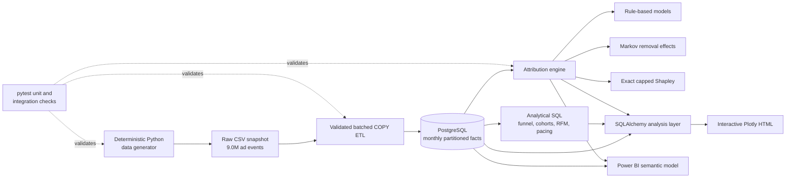

## Live application

**Streamlit dashboard:** Not deployed yet

**Deploy to Streamlit:** [https://share.streamlit.io/deploy?repository=Aakanshak/Project_03_DA&branch=main&mainModule=src/app.py](https://share.streamlit.io/deploy?repository=Aakanshak/Project_03_DA&branch=main&mainModule=src/app.py)

**GitHub repository:** [https://github.com/Aakanshak/Project_03_DA](https://github.com/Aakanshak/Project_03_DA)
# Retail Media Intelligence and Marketing Attribution Platform

CPG brands often optimize retail-media budgets using Last Touch, which rewards
the ad closest to purchase and can understate the channels that created demand.
This project simulates an Amazon Ads/Walmart Connect-style network and builds an
end-to-end analytics platform to measure that distortion. Across 9.0M ad events,
Last Touch assigned 67.2% of conversion credit to bottom-funnel Sponsored
Product placements; Shapley attribution assigned 45.7%—a 21.5 percentage-point
or 32.0% relative reduction, implying a hypothetical $4.75K budget-share shift
at the project’s $22.1K media-spend scale.

## Architecture



## Tech stack

| Layer | Technology | Implementation |
|---|---|---|
| Data generation | Python, Faker, NumPy, pandas | Seeded 18-month retail-media simulation |
| Warehouse | PostgreSQL | PK/FK constraints, monthly event partitions, analytical indexes |
| ETL | psycopg 3, pandas | Transactional truncate/reload and 250K-row batched `COPY` |
| Analytics | PostgreSQL SQL | CTEs, windows, cohorts, RFM, pacing, incrementality proxy |
| Attribution | Python, NumPy | Rule-based, absorbing Markov chain, exact capped Shapley |
| Application layer | SQLAlchemy | PostgreSQL-backed analysis and dashboard queries |
| Visualization | Plotly, Power BI | Six standalone HTML charts and four-page BI specification |
| Quality | pytest | Statistical, attribution, ETL validation, chart, and DB row-count tests |

## Key findings

- The generated funnel contains **8,945,335 impressions**, **53,947 clicks**,
  **7,013 cart adds**, and **2,626 paid purchases**: 0.603% CTR, 13.0%
  click-to-cart, and 37.4% cart-to-purchase.
- Last Touch allocated **67.2%** of conversion credit to bottom-funnel
  Sponsored Product placements. Shapley allocated **45.7%**, reducing their
  share by **21.5 percentage points (32.0% relative)**.
- Shapley increased upper-funnel Display/Video credit from **13.0% to 38.1%**,
  a **25.1-point** shift. Markov moved upper-funnel credit only to **13.2%**,
  reflecting a journey graph that remains strongly bottom-funnel.
- The snapshot generated **$64,004** in attributed revenue on **$22,103** of ad
  spend: **2.90x ROAS** and **34.5% ACOS**. Applying the 21.5-point model delta
  mechanically to spend represents a **$4,753 hypothetical allocation shift**,
  not a causal savings estimate.

## Data scope

- 50 advertisers
- 500 products
- 50,000 customers
- 300 campaigns
- 9,008,921 ad events
- 15,040 orders
- 51,809 customer journeys
- January 1, 2024 through June 30, 2025

The generator includes campaign-, placement-, advertiser-tier-, device-,
weekday-, loyalty-, price-, and promotion-dependent behavior. Back-to-school
and holiday periods create approximately 3x volume spikes, and an 8% customer
holdout receives no ad exposure.

## Run locally

### Prerequisites

- Python 3.14
- PostgreSQL
- Bash, Git Bash, or WSL for the one-command runner
- Approximately 2 GB of free disk space

### One-command pipeline

Create the environment file and set valid PostgreSQL credentials:

```bash
cp .env.example .env
```

Run:

```bash
bash setup.sh
```

The script creates `.venv`, installs pinned dependencies, generates the full
dataset, creates and loads PostgreSQL, executes analytical SQL, runs attribution,
exports Plotly dashboards, and runs pytest.

### Manual execution

```bash
python -m venv .venv
source .venv/bin/activate
pip install -r requirements.txt

python src/data_generation/generate_data.py --overwrite
python src/etl/load_to_postgres.py --create-schema
python -m src.analysis.run_sql_queries
python -m src.attribution.model_comparison
python -m src.analysis.plotly_dashboard
pytest -q
```

Windows PowerShell activation:

```powershell
.\.venv\Scripts\Activate.ps1
```

## Testing

Standard unit suite:

```bash
pytest -q
```

The suite verifies:

- generated funnel rates remain within configured statistical bounds;
- dimensions are deterministic for a fixed seed;
- paid orders and journey touchpoints preserve source lineage;
- each rule-based model conserves 1.0 credit per converted path;
- Markov removal effects and normalized Shapley credits are non-negative;
- every Plotly chart builds and exports as standalone HTML.

PostgreSQL post-load row-count integrity is opt-in:

```bash
RUN_POSTGRES_INTEGRATION=1 pytest -q -m integration
```

This compares every generated CSV row count with its loaded PostgreSQL table,
including the partitioned `fact_ad_events` parent.

## Outputs

### Streamlit portfolio app

The deployable application is defined in `streamlit_app.py` and combines:

- executive KPIs and seasonal spend/revenue;
- campaign funnels and efficiency;
- Last Touch, Linear, Markov, and Shapley attribution;
- RFM segmentation and cohort retention;
- Excel-compatible campaign and attribution downloads;
- direct links to the Power BI semantic-model specification.

For Streamlit Cloud, compact analytical aggregates are committed under
`app_data/`. The full 909 MB event fact remains excluded from Git and can be
regenerated deterministically.

Run locally:

```bash
streamlit run streamlit_app.py
```

### Attribution

- [Methodology](docs/attribution_methodology.md)
- `data/processed/attribution_model_comparison.csv`
- `data/processed/attribution_model_comparison_long.csv`
- `data/processed/attribution_model_comparison_by_stage.csv`

### Interactive Plotly

- `dashboards/plotly/01_campaign_funnel.html`
- `dashboards/plotly/02_daily_spend_vs_revenue.html`
- `dashboards/plotly/03_attribution_model_comparison.html`
- `dashboards/plotly/04_cohort_retention_heatmap.html`
- `dashboards/plotly/05_rfm_segment_scatter.html`
- `dashboards/plotly/06_budget_pacing_control_chart.html`

### Power BI handoff

- [Semantic model](dashboards/powerbi/data_model.md)
- [DAX measures](dashboards/powerbi/dax_measures.md)
- [Page specification](dashboards/powerbi/page_layout.md)
- [PostgreSQL connection setup](docs/powerbi_connection_setup.md)

## Screenshots and demos

Replace the placeholders below with captured assets before publishing:

- [Plotly funnel screenshot placeholder](docs/assets/plotly-funnel-placeholder.svg)
- [Attribution comparison GIF placeholder](docs/assets/attribution-comparison-placeholder.svg)
- [Power BI executive summary placeholder](docs/assets/powerbi-executive-summary-placeholder.svg)
- [Power BI attribution page placeholder](docs/assets/powerbi-attribution-page-placeholder.svg)

The generated standalone HTML dashboards remain the source-of-truth interactive
demos under `dashboards/plotly/`.

## Limitations

- The dataset is synthetic. Statistical relationships are intentional and
  realistic, but they do not reproduce a specific retailer’s auction,
  identity, inventory, or customer behavior.
- Attribution is observational. The 8% unexposed cohort supports an
  incrementality proxy, but this is not a randomized experiment with enforced
  treatment assignment and confidence intervals.
- The Markov model is first-order: the next state depends on the current state,
  not the complete prior journey.
- Exact Shapley evaluation is exponential and is capped at the top eight
  channels. Lower-volume channels receive no exact-Shapley credit in that run.
- The $4.75K reallocation is scenario analysis derived from model-credit shares;
  it is not a claim of realized savings or incremental revenue.
- Power BI artifacts are specifications rather than a committed `.pbix`, because
  the binary file must be assembled in Power BI Desktop.

## Documentation

- [Attribution methodology](docs/attribution_methodology.md)
- [Power BI connection guide](docs/powerbi_connection_setup.md)
- [Resume-ready bullets](docs/resume_bullets.md)
